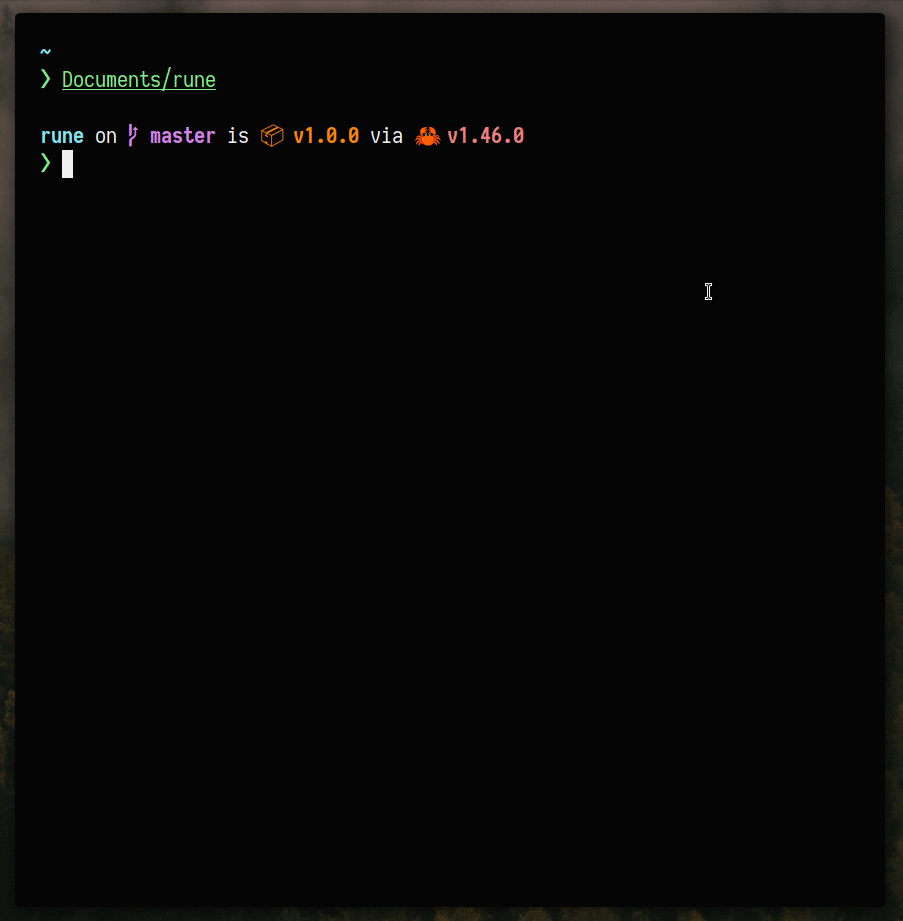

<p align="center">
  
  <br />
  <i>An extensible task execution and generation tool</i>
</p>

<p align="center">
  
  
  
  
  
  
  <br />
</p>

<hr>

## ✨ Installation

From AUR:

> Not complete yet

From `cargo`:

```sh
cargo install rune-rs
```

From source:

```sh
git clone https://github.com/safinsingh/rune.git
cargo build --release

# for subsequent builds
rune release
```

## 🔮 In action

<p align="center">
  
</p>

## 📖 Usage

All Rune targets are defined in `Rune.example` like so:

```yaml
# Global information, name and version
# Are required
name: Rune
version: 1.0.0
author: Safin Singh

# Array of all goals
goals:
  # Default goal runs when none are specified
  default: echo hi

  # An array of commands
  two:
    - echo hi
    - echo hi2

  # An array of commands with messages
  # that are displayed in verbose mode
  three:
    - message: execute command
      cmd:
        - echo hello
        - echo hello2
    - message: execute command
      cmd:
        - echo hello
        - echo hello2
```

## 👨‍💻 Author

Linkedin: [Safin Singh](https://www.linkedin.com/in/safin-singh-b2630918a/) <br>
GitHub: [safinsingh](https://github.com/safinsingh) <br>
Dribbble: [Safin Singh](https://dribbble.com/safinsingh/) <br>
YouTube: [Safin Singh](https://www.youtube.com/channel/UCvb01sUdAgcPAG1j0SLxAtA)

## 🤝 Contributing

Contributions, PRs, issues and feature requests are welcome! Feel free to check out my [issues page](https://github.com/safinsingh/rune/issues).

## ❤️ Show your support

Give a ⭐️ if this project helped you!
Hope you enjoy it!
